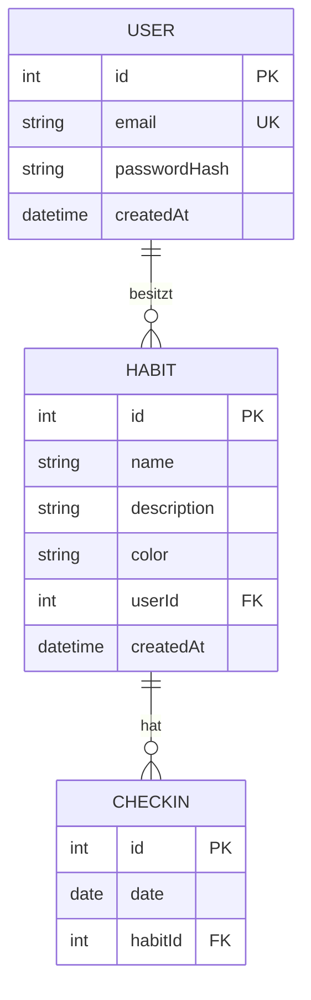

# Habit-Tracker API

Der Habit-Tracker ist eine REST-API, mit der registrierte Nutzer:innen eigene Gewohnheiten (Habits) anlegen, jeden Tag abhaken (Check-ins) und ihren Fortschritt über Streaks und eine Statistik verfolgen können.

Zielgruppe sind Einzelpersonen, die ihre Gewohnheiten digital verfolgen wollen. Die API wird von einem React-Frontend genutzt.


## Live-URL

Wird nach dem Deployment ergänzt.


## Datenmodell (ERD)



## Endpunkte (geplant)

| Methode | Pfad | Zweck | Auth |
|---|---|---|---|
| POST | `/api/auth/register` | Konto erstellen | nein |
| POST | `/api/auth/login` | Einloggen, JWT erhalten | nein |
| GET | `/api/habits` | Eigene Habits mit aktueller Streak (`?search=`, `?page=`, `?limit=`) | ja |
| POST | `/api/habits` | Habit anlegen | ja |
| GET | `/api/habits/:id` | Ein Habit ansehen | ja |
| PATCH | `/api/habits/:id` | Habit ändern (Name, Beschreibung, Farbe) | ja |
| DELETE | `/api/habits/:id` | Habit löschen | ja |
| POST | `/api/habits/:id/checkins` | Für ein Datum abhaken | ja |
| GET | `/api/habits/:id/checkins` | Check-ins ansehen (`?from=&to=`) | ja |
| DELETE | `/api/habits/:habitId/checkins/:id` | Check-in zurücknehmen | ja |
| GET | `/api/stats` | Gesamtzahl der Check-ins und Streaks | ja |
| GET | `/api/health` | Prüfen, ob der Server läuft | nein |

## Beispiele für Anfragen und Antworten

### Registrieren

`POST /api/auth/register`

```json
{ "email": "anna@example.com", "password": "geheim1234" }
```

Antwort `201 Created`:

```json
{ "id": 1, "email": "anna@example.com" }
```

### Einloggen

`POST /api/auth/login`

```json
{ "email": "anna@example.com", "password": "geheim1234" }
```

Antwort `200 OK`:

```json
{ "token": "<JWT>" }
```

### Habit anlegen

`POST /api/habits` mit Header `Authorization: Bearer <JWT>`

```json
{ "name": "10 Minuten lesen", "description": "Vor dem Schlafen", "color": "#4F46E5" }
```

Antwort `201 Created`:

```json
{
  "id": 4,
  "name": "10 Minuten lesen",
  "description": "Vor dem Schlafen",
  "color": "#4F46E5",
  "streak": 0,
  "createdAt": "2026-09-30T09:15:00.000Z"
}
```

### Abhaken

`POST /api/habits/4/checkins`

```json
{ "date": "2026-09-30" }
```

Antwort `201 Created`:

```json
{ "id": 12, "date": "2026-09-30", "habitId": 4 }
```

### Fehlerfälle

**400 Bad Request** (ungültige Eingabe, z. B. Name fehlt)

```json
{
  "error": "Validierungsfehler",
  "details": [{ "field": "name", "message": "Name ist erforderlich" }]
}
```

**401 Unauthorized** (Token fehlt, ungültig oder abgelaufen; auch bei falschem Login)

```json
{ "error": "Nicht authentifiziert" }
```

**404 Not Found** (Habit existiert nicht oder gehört einem anderen User)

```json
{ "error": "Habit nicht gefunden" }
```

**409 Conflict** (Check-in für dieses Datum existiert bereits, oder E-Mail bereits registriert)

```json
{ "error": "Für dieses Datum existiert bereits ein Check-in" }
```

**429 Too Many Requests** (Rate Limit bei Login oder Registrierung überschritten)

```json
{ "error": "Zu viele Anfragen. Bitte später erneut versuchen." }
```

## Authentifizierung und Autorisierung

**Authentifizierung (Wer bist du?)**

- Beim Registrieren wird das Passwort mit bcrypt gehasht und nur der Hash gespeichert.
- Beim Login wird das Passwort gegen den Hash geprüft. Bei Erfolg erhält der Client ein JWT, das die User-ID enthält und nach begrenzter Zeit abläuft.
- Der Client schickt das Token bei jeder geschützten Anfrage im Header `Authorization: Bearer <Token>`.
- Eine Auth-Middleware prüft Signatur und Ablaufzeit des Tokens und stellt die User-ID für die Controller bereit.

**Autorisierung (Was darfst du?)**

- Jeder User darf nur seine eigenen Habits und deren Check-ins sehen und ändern.
- Jede Datenbankabfrage filtert zusätzlich nach der `userId` aus dem Token.
- Fremde oder nicht vorhandene Ressourcen führen zu `404`, damit nicht erkennbar ist, welche IDs existieren.

## Tech-Stack

| Technologie | Wofür | Begründung |
|---|---|---|
| Node.js + Express | Webserver und Routing | Im Kurs gelernt, schlank, große Community, passt gut zu einem React-Frontend (beides JavaScript) |
| PostgreSQL | Datenbank | Relationale Datenbank passt zu den klaren Beziehungen User, Habit, CheckIn; Fremdschlüssel und Unique-Bedingungen sichern die Datenintegrität |
| Prisma | ORM | Typsichere Abfragen, Migrationen, das Schema dient zugleich als Dokumentation des Datenmodells |
| JWT + bcrypt | Authentifizierung | Zustandslos, gut für eine API mit getrenntem Frontend; bcrypt speichert Passwörter sicher als Hash |
| Zod | Validierung | Schemas beschreiben erlaubte Eingaben klar und liefern verständliche Fehlermeldungen |
| helmet, cors, express-rate-limit | Sicherheit | Sichere HTTP-Header, gezielte Freigabe für das Frontend, Schutz vor Missbrauch bei Login und Registrierung |
| Jest + Supertest | Tests | Integrationstests gegen die echten Endpunkte, ohne einen Port zu öffnen |
| React (Vite) | Frontend | Komponentenbasiert, schnell einzurichten |
| Render | Deployment | Backend, Datenbank und Frontend an einem Ort bereitstellbar |

## Installation und Start

Wird ergänzt, sobald das Backend läuft.

## Konfiguration

Wird ergänzt (Umgebungsvariablen, siehe `.env.example`).

## Tests

Wird ergänzt.